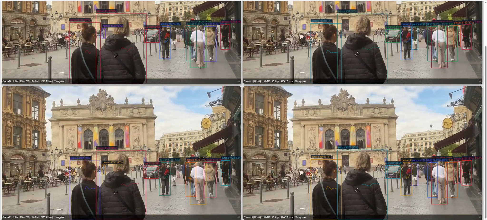

# Multi-Stream Tracker

## Metadata

| Field | Value |
| --- | --- |
| Category | tracking |
| Difficulty | Advanced |
| Tags | object-detection, yolo26, rtsp, multistream, insight, multi-object-tracking, bytetrack |
| Languages | C++, Python |
| Status | stable |
| Binary Name | multi-stream-tracker |
| Model | yolo26m-det-int8-b1 |

## Concept

Tracks up to five object classes, such as people and cars, across multiple RTSP streams with YOLO26. Each class has its own ByteTrack-style tracker settings. Every track gets a stable ID, and the app sends live video plus tracking metadata (class label and track ID) to Insight.

## Preview



## Prerequisites

- `sima-cli` ([documentation](https://developer.sima.ai/software/tools/sima-cli/)) on a supported Modalix or DevKit target.
- H.264 or H.265 RTSP sources matching `input.codec`, and an [Insight](https://developer.sima.ai/software/tools/insight/) URL reachable from the target.
- For H.265, the computer running the Insight viewer must support hardware HEVC decoding; Chromium does not provide a software decoder fallback for WebRTC H.265.

## Install Apps

Install the latest Neat Apps runtime and enter the installed bundle:

```bash
sima-cli neat install apps
cd prebuilt-apps
APP_DIR=examples/tracking/multi-stream-tracker
```

Run the remaining commands from `prebuilt-apps/`.

## Prepare the Model

| Model file | Role |
| --- | --- |
| `yolo26m-det-int8-b1.tar.gz` | Default |
| `yolo26n-det-bf16-mla_tess-b1.tar.gz` | Supported |
| `yolo26s-det-bf16-mla_tess-b1.tar.gz` | Supported |
| `yolo26m-det-bf16-mla_tess-b1.tar.gz` | Supported |
| `yolo26l-det-bf16-mla_tess-b1.tar.gz` | Supported |
| `yolo26x-det-bf16-mla_tess-b1.tar.gz` | Supported |
| `yolo26m-det-bf16-b1.tar.gz` | Supported |

Model packages come from the Model Zoo release below, which can differ from the installed platform version. Replace `<model-file>` with a file from the table.

```bash
export MODELZOO_VERSION="2.1.3"
mkdir -p models
cd models
sima-cli download "https://docs.sima.ai/pkg_downloads/SDK${MODELZOO_VERSION}/models/modalix/yolo26-detection/<model-file>"
cd ..
```

Set `model.path` in the config to the downloaded package.

## Prepare Insight

[Insight](https://developer.sima.ai/software/tools/insight/) can host the input streams and render tracking metadata. Install videos directly from the Insight catalog or through Insight's YouTube support.

In the Insight Web UI, start the required streams and copy their RTSP URLs into `streams`. Use the host and UDP port ranges reported by `neat` for the output settings.

## Configure

Open `${APP_DIR}/src/common/config.yaml`. Set `model.path`, add each RTSP URL under `streams`, and set the Insight host and starting video and metadata ports. Set `input.codec` to match the streams.

List the classes to track under `tracking.classes`. The list takes one to five entries. `class` is a COCO class name or ID. Every other key is optional and applies to that class only:

```yaml
tracking:
  classes:
    - class: person
    - class: car
      match_iou_threshold: 0.15
      max_missing_frames: 45
      velocity_noise: 0.0125
```

| Key | Default | Effect |
| --- | --- | --- |
| `high_score_threshold` | 0.50 | Detections at or above this score match first. |
| `low_score_threshold` | 0.10 | Detections between the low and high thresholds only keep existing tracks alive. |
| `new_track_threshold` | 0.60 | Minimum score to start a track. |
| `match_iou_threshold` | 0.20 | Minimum IoU between the predicted box and a detection. Lower it for fast objects. |
| `low_match_iou_threshold` | 0.50 | Minimum IoU for low-score matches. |
| `max_missing_frames` | 30 | Frames a lost track waits to be matched again. |
| `min_confirmed_hits` | 2 | Matches before a track is published. |
| `position_noise` | 0.05 | Kalman position noise, relative to box height. |
| `velocity_noise` | 0.00625 | Kalman velocity noise. Raise it for objects that change speed quickly. |

The app rejects empty, duplicate (`car` and `2` count as duplicates), unknown, and more than five classes. It also rejects unknown keys. `inference.min_score` must not exceed any class's `low_score_threshold`, or the detector drops the low-score detections the tracker needs.

Set `output.detections_log` to a path prefix to record raw detections per stream for offline tracker comparison.

## Run

### C++

```bash
./${APP_DIR}/src/cpp/pre-built/multi-stream-tracker \
  --config ${APP_DIR}/src/common/config.yaml
```

### Python

```bash
source ~/pyneat/bin/activate
pip install -r ${APP_DIR}/src/python/requirements.txt
python3 ${APP_DIR}/src/python/main.py \
  --config ${APP_DIR}/src/common/config.yaml
```

## Tracker

Each stream runs one tracker per configured class, so a detection can only match a track of its own class, and tracks never change class. Track IDs are unique within a stream. The C++ and Python trackers are the same algorithm. `tests/common/tracker_golden.json` holds shared replay cases that both unit tests must reproduce exactly.

The tracker follows ByteTrack:

1. A constant-velocity Kalman filter predicts each track's box, using the class's noise settings.
2. High-score detections are matched to tracks by optimal (Hungarian) assignment on IoU with the predicted box. Lost tracks are included, so a track survives short occlusions.
3. Low-score detections can only extend tracks that are still active. This recovers objects whose confidence drops briefly, without creating false tracks.
4. Unmatched high-score detections above `new_track_threshold` start tentative tracks. These are published after `min_confirmed_hits` matches.

### Why ByteTrack

Three trackers were compared on the same recorded detections using `tools/compare_trackers.py`:

- `greedy_iou`: the previous people-tracker matcher, with no motion model.
- `greedy_cv`: greedy IoU with constant-velocity prediction, from `yolo26-tiny-drone-tracker`.
- `bytetrack`: this example.

The real videos have no ground-truth labels, so the report uses proxies. Fewer unique IDs and longer tracks for the same objects mean fewer broken tracks. Detections came from `yolo26m-det-bf16-mla_tess-b1` on a Modalix DevKit.

| Video (classes) | Tracker | Unique IDs | Mean track length | Tracks < 5 frames | Re-births |
| --- | --- | --- | --- | --- | --- |
| Motorbike race, 1080p30, 900 frames (person, motorcycle) | greedy_iou | 399 | 17.9 | 198 | 11 |
| | greedy_cv | 381 | 20.6 | 144 | 52 |
| | **bytetrack** | **157** | **39.0** | **4** | **0** |
| Pedestrians crossing, 720p30, 600 frames | greedy_iou | 33 | 64.8 | 5 | 1 |
| | greedy_cv | 30 | 74.7 | 2 | 0 |
| | **bytetrack** | **22** | **94.0** | **2** | **0** |
| Highway 1, 720p16, 600 frames (car, truck) | greedy_iou | 462 | 11.4 | 224 | 28 |
| | greedy_cv | 261 | 24.8 | 94 | 11 |
| | **bytetrack** | **125** | **36.6** | **17** | **1** |
| Intersection, 720p16, 600 frames (car, truck, bus) | greedy_iou | 104 | 33.3 | 36 | 9 |
| | greedy_cv | 70 | 64.9 | 10 | 3 |
| | **bytetrack** | **22** | **115.2** | **1** | **0** |
| Highway 2, 720p16, 600 frames (car, truck) | greedy_iou | 243 | 11.2 | 124 | 9 |
| | greedy_cv | 203 | 15.2 | 87 | 8 |
| | **bytetrack** | **105** | **23.0** | **17** | **0** |

A re-birth is a new track that starts where a track of the same class ended within the previous 30 frames.

Synthetic scenarios with ground truth (mean of 10 seeds; IDF1 and ID switches, higher and lower are better):

| Scenario | greedy_iou | greedy_cv | bytetrack |
| --- | --- | --- | --- |
| Crossing with occlusion | 0.651 / 3.0 | 0.974 / 0.0 | **0.978 / 0.0** |
| Short occlusion (8–10 frames) | 0.553 / 2.0 | 0.953 / 0.0 | **0.963 / 0.0** |
| 25% missed detections | 0.852 / 0.0 | 0.852 / 0.0 | 0.849 / 0.0 |
| Low-confidence frames | 0.893 / 0.0 | 0.992 / 0.0 | **0.992 / 0.0** |
| Different speeds (up to 70 px/frame) | 0.733 / 16.9 | 0.899 / 1.6 | **0.905 / 0.5** |

ByteTrack gives the most stable IDs on every real video. It also removes the synthetic false positives, because unconfirmed and low-score detections never start a track. It stays small, at about 300 lines per language with no dependencies.

Known limits:

- ByteTrack publishes fewer boxes (FN is slightly higher) because it holds new tracks for `min_confirmed_hits` frames and does not draw lost tracks.
- There is no appearance model, so an object hidden longer than `max_missing_frames`, or one that crosses a same-class object while both are occluded, can still get a new ID.
- Scene cuts in edited video, such as the race footage, always start new IDs.

To reproduce the comparison from a source checkout, record logs with `output.detections_log`, then run:

```bash
python3 examples/tracking/multi-stream-tracker/tools/compare_trackers.py \
  --config <config.yaml> --log <prefix>.stream0.jsonl
```

## Troubleshooting

- Start with one stream before scaling to multiple inputs.
- Verify `model.path`, every RTSP URL, and the Insight port ranges.
- Set either inflight limit to `-1` to use the Core default.
- Use `output.debug_dir` and `output.save_every` to save sampled overlays. They are drawn on the latest decoded frame, which can be a few frames newer than the detections, so fast objects can look offset. Insight matches metadata to video by timestamp and does not have this offset.
- All streams must have the same resolution.

## Source Files

- C++ reference source: `src/cpp/main.cpp`
- C++ tracker helpers: `src/cpp/utils/`
- Python source: `src/python/main.py`
- Python tracker helpers: `src/python/utils/`
- Tracker comparison tools (source checkout only): `tools/`
- Shared runtime files: `src/common/`

The packaged C++ source is an implementation reference. Run the executable under `src/cpp/pre-built/`; the installed bundle does not include CMake files.

## Development From Source

To modify, compile, or test this example, use the [Apps contributor workflow](https://github.com/sima-neat/apps/blob/main/CONTRIBUTING.md).
