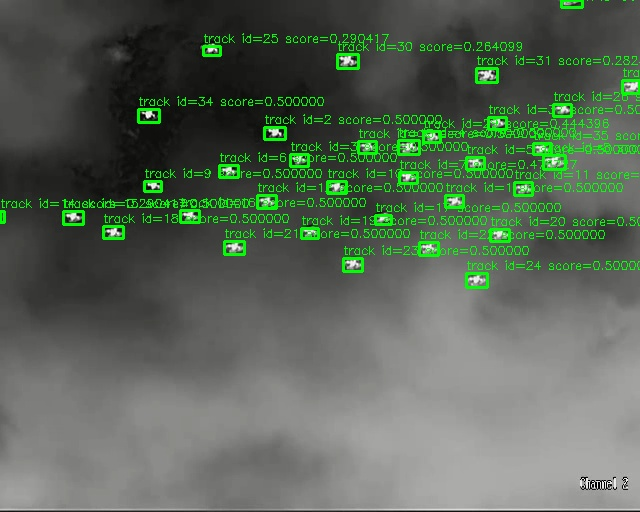

# YOLO26 Tiny-Drone Tracker

## Metadata

| Field | Value |
| --- | --- |
| Category | tracking |
| Difficulty | Advanced |
| Tags | object-detection, yolo26, rtsp, insight, tiny-drone, tracking |
| Languages | C++, Python |
| Status | stable |
| Binary Name | yolo26-tiny-drone-tracker |
| Model | yolo26n-p2-tiny-drone-int8-qat |

## Concept

Track tiny drones across up to four RTSP streams with YOLO26 and publish
annotated video plus per-stream tracking metadata to Insight.

The tracker combines high-confidence association, low-confidence recovery, and
bounded motion matching so small, fast-moving detections can retain stable
per-stream IDs.

## Preview



## Prerequisites

- `sima-cli` 2.1.15 or newer
  ([documentation](https://developer.sima.ai/software/tools/sima-cli/)) on a
  supported Modalix or DevKit target.
- One or more H.264 or H.265 RTSP sources and an
  [Insight](https://developer.sima.ai/software/tools/insight/) endpoint
  reachable from the target.
- For H.265, the computer running the Insight viewer must support hardware
  HEVC decoding; Chromium does not provide a software decoder fallback for
  WebRTC H.265.

## Install Apps

Install the latest Neat Apps runtime and enter the installed bundle:

```bash
sima-cli neat install apps
cd prebuilt-apps
APP_DIR=examples/tracking/yolo26-tiny-drone-tracker
```

Run the remaining commands from `prebuilt-apps/`.

## Prepare the Model

Download the tested SDK 2.1.3 model artifact:

```bash
export MODELZOO_VERSION="2.1.3"
mkdir -p models
cd models
sima-cli download \
  "https://docs.sima.ai/pkg_downloads/SDK${MODELZOO_VERSION}/models/modalix/yolo26n_p2_tiny_drone_int8_qat_b1_mpk.tar.gz"
cd ..
```

The command stores
`models/yolo26n_p2_tiny_drone_int8_qat_b1_mpk.tar.gz`.

## Prepare Insight

Use the source video packaged with Apps:

`assets/datasets/yolo26-tiny-drone-tracker/anti_uav_multi_uav_source_demo.mp4`

In the Insight Web UI, open `RTSP Source`, upload this video, start its stream,
and copy the RTSP URL into `streams`. Use the host and UDP port ranges reported
by `neat` for the output settings.

## Configure

Use the packaged configuration as the source of truth:
`examples/tracking/yolo26-tiny-drone-tracker/src/common/config.yaml`.

Set `streams` to the Insight RTSP URLs. Confirm `input.codec` and `input.tcp`
match each source, then set `output.insight.host`, `video_port_base`, and
`metadata_port_base` to the values reported by `neat`. The prepared model path
already matches the package installed above; change `model.path` only if the
archive is installed elsewhere.

Track IDs are local to each stream. Lower-confidence detections may recover a
confirmed track but cannot create or confirm an identity.

## Run

Validate the config without opening a stream:

```bash
APP_BIN="$APP_DIR/src/cpp/pre-built/yolo26-tiny-drone-tracker"
CONFIG="$APP_DIR/src/common/config.yaml"
"$APP_BIN" \
  --config "$CONFIG" \
  --validate-config-only
```

### C++

```bash
APP_BIN="$APP_DIR/src/cpp/pre-built/yolo26-tiny-drone-tracker"
CONFIG="$APP_DIR/src/common/config.yaml"
"$APP_BIN" --config "$CONFIG"
```

### Python

```bash
APP_DIR=examples/tracking/yolo26-tiny-drone-tracker
source ~/pyneat/bin/activate
pip install -r "$APP_DIR/src/python/requirements.txt"
python3 "$APP_DIR/src/python/main.py" \
  --config "$APP_DIR/src/common/config.yaml"
```

## Troubleshooting

- Start with one stream before adding more inputs.
- Verify the model path, RTSP URL, codec, Insight host, and UDP port ranges.
- Keep `inference.num_classes: 1`; it must match the model's class-head depth.
- Set either inflight limit to `-1` to use the Core default.
- Use `output.debug_dir` and `output.save_every` to save sampled overlays.

## Source Files

- C++ reference source: `src/cpp/main.cpp`
- C++ tracker implementation: `src/cpp/utils/`
- Python source: `src/python/main.py`
- Python tracker implementation: `src/python/utils/`
- Shared runtime configuration: `src/common/config.yaml`

The packaged C++ source is an implementation reference. Run the executable
under `src/cpp/pre-built/`; the installed bundle does not include CMake
files.

## Development From Source

To modify, compile, or test this example, use the
[Apps contributor workflow](https://github.com/sima-neat/apps/blob/main/CONTRIBUTING.md).
